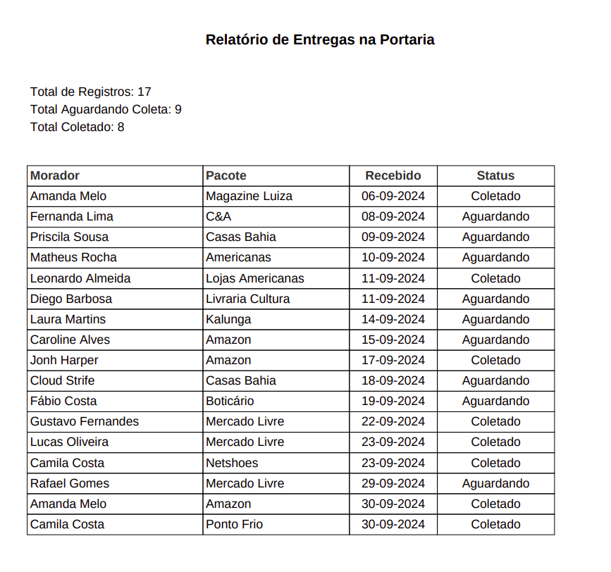

# 📦 Relatório de Entregas na Portaria

 

Este projeto didático automatiza a geração de relatórios de entregas recebidas na portaria de condomínios.



## 🚀 Tecnologias Utilizadas

- **Python** 
- **fpdf2** para criação do PDF

## 📂 Como Utilizar

1. Clone o repositório:
   ```bash
   git clone https://github.com/Antonio-Ramon/report-package.git
   ```
2. Instale as dependências:
    ```bash
   pip install -r requirements.txt
   ```
3. Execute o script para gerar o relatório:
    ```bash
   python3 main.py
   ```

## Licença

Este projeto está sob a licença MIT.
